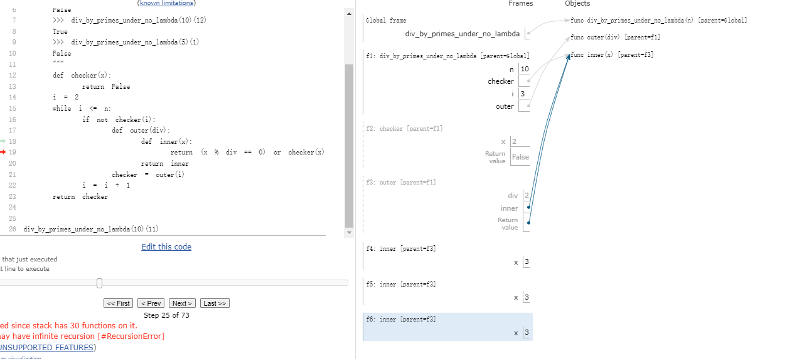

遇见ModuleNotFoundError: No module named 'urllib3.packages.six.moves'错误需要降低python版本(如3.8版本)。

## lab01

python中函数返回值会打印出来

## lab02

可以看到每次执行multiply_by的时候会创造一个在内存中的函数对象

```python
>>> def multiply_by(m):
...     def multiply(n):
...         return n * m
...     return multiply
... 
>>> multiply_by(2)
<function multiply_by.<locals>.multiply at 0x7e2ae81081f0>
>>> multiply_by(2)
<function multiply_by.<locals>.multiply at 0x7e2ae8108280>
>>> multiply_by(2)
<function multiply_by.<locals>.multiply at 0x7e2ae81081f0>
>>> multiply_by(2)
<function multiply_by.<locals>.multiply at 0x7e2ae8108280>
>>> a=multiply_by(2)
>>> a
<function multiply_by.<locals>.multiply at 0x7e2ae81081f0>
>>> b=multiply_by(2)
>>> b
<function multiply_by.<locals>.multiply at 0x7e2ae8108280>
>>> c=multiply_by(2)
>>> c
<function multiply_by.<locals>.multiply at 0x7e2ae8108310>
```

lambda函数与def的函数区别是在系统中没有函数名字绑定

```python
>>> def c():
...     return 1
... 
>>> c
<function c at 0x7e2ae81083a0>
>>> lambda : 1
<function <lambda> at 0x7e2ae8108280>
>>> a=lambda : 1
>>> a
<function <lambda> at 0x7e2ae8108310>
>>> b=a
>>> b
<function <lambda> at 0x7e2ae8108310>
>>> b=c
>>> b
<function c at 0x7e2ae81083a0>
```

True and 10返回的是10，第二个算术的值，而不是and最后结果(为啥？？)

print返回None，无返回值

若返回值是"xxx",则打印'xxx'。print("xxx")则打印xxx

## hog

def make_test_dice(*outcomes):的*outcomes表示可以接收不定数量参数元素，会收集到元组outcomes中

注意PROBLEM 8的original_function参数形式不确定，不一定是示例中的roll_dice，它目的是确定多次调用一个加分函数所加的分平均值，而加分函数根据策略有不同的参数

PROBLEM 12 需要考虑运行时间，所以不能算太多

## lab03

div_by_primes_under(_no_lambda)用环境图看一下执行流debug，不要自己用眼睛看

div_by_primes_under(_no_lambda)是较难的，一个错误解法如下

```python
def div_by_primes_under(n):
    """
    >>> div_by_primes_under(10)(11)
    False
    >>> div_by_primes_under(10)(121)
    False
    >>> div_by_primes_under(10)(12)
    True
    >>> div_by_primes_under(5)(1)
    False
    """
    checker = lambda x: False
    i = 2
    while i <= n:
        """此时进行checker判断时, 会导致checker的x是i，(x % i == 0)部分恒成立(这里期望应该是x除以上次质数的i)"""
        if not checker(i):
            checker = lambda x :(x % i == 0) or checker(x)
        i = i + 1
    return checker
```

修改上述错误，在checker里面不使用i，而使用传入div

```python
def div_by_primes_under(n):
    """
    >>> div_by_primes_under(10)(11)
    False
    >>> div_by_primes_under(10)(121)
    False
    >>> div_by_primes_under(10)(12)
    True
    >>> div_by_primes_under(5)(1)
    False
    """
    checker = lambda x: False
    i = 2
    while i <= n:
        """此时执行checker时候，(x % div == 0)没问题，但执行了or后面的checker，于是产生无限递归"""
        if not checker(i):
            checker = (lambda div: lambda x :(x % div == 0) or checker(x))(i)
        i = i + 1
    return checker
```

使用环境图可以看到



最终解决方案，让func也是临时参数

```python
def div_by_primes_under(n):
    """
    >>> div_by_primes_under(10)(11)
    False
    >>> div_by_primes_under(10)(121)
    False
    >>> div_by_primes_under(10)(12)
    True
    >>> div_by_primes_under(5)(1)
    False
    """
    checker = lambda x: False
    i = 2
    while i <= n:
        """此时的checker_func则是内存中另外一个副本，不会跟随checker变化而变化，不会有递归"""
        if not checker(i):
            checker = (lambda div, checker_func: lambda x :(x % div == 0) or checker_func(x))(i, checker)
        i = i + 1
    return checker
```

这道题核心思想是在内存中递归创建**多个checker_func实例**，每个checker_func是要判断与一个质数的相除。

上面关键在于有时候实例并没有完全创建出来。可能还需要进一步思考

## lab05

思考将flatten变成迭代

## lab06

```python
>>> a, b = lst, lst[:]
>>> a is lst
True
>>> b == lst
True
>>> b is lst
False

>>> lst=[1, 2, 3, 4, 5]
>>> lst.extend([lst.append(9), lst.append(10)])
>>> lst
[1, 2, 3, 4, 5, 9, 10, None, None]

>>> r = range(6)
>>> r_iter = iter(r)
>>> next(r_iter)
0
>>> [x + 1 for x in r_iter]
[2, 3, 4, 5, 6]
>>> next(r_iter)
StopIteration

>>> map_iter = map(lambda x : x + 10, range(5))
>>> next(map_iter)
10
>>> next(map_iter)
11
>>> list(map_iter)
[12, 13, 14]

>>> [x + y for x, y in zip([1, 2, 3], [4, 5, 6])]
[5, 7, 9]
>>> for e in zip([10, 9, 8], range(3)):
...   print(tuple(map(lambda x: x + 2, e)))
(12, 2)
(11, 3)
(10, 4)
```

两数交换可以用`a, b = b, a`

## cats

autocorrect函数解法使用了min的高级特性

**提前终止递归的方法**

第六题第七题巧妙

第六题的feline_fixes函数要注意，定义了def feline_fixes_helper(cur_diff, typed, source, limit)函数，cur_diff是指在递归到这里前已经有多少不同，返回值是后面有多少不同。

第十题巧妙使用列表推导以及min

获取某个条件下的一个数列最小值可以像这个题目的min，不用再写循环

## lab07

类的函数需要self的不能直接使用类名调用，但可以带实例参数调用，如Car.drive()不可，Car.drive(car)可


## lab08

基类可以强转为继承类

直接使用继承类的函数调用基类变量就行
